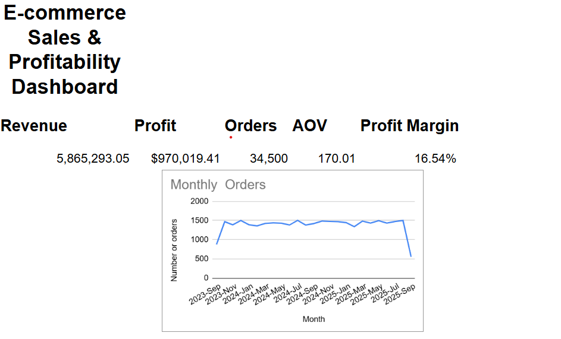
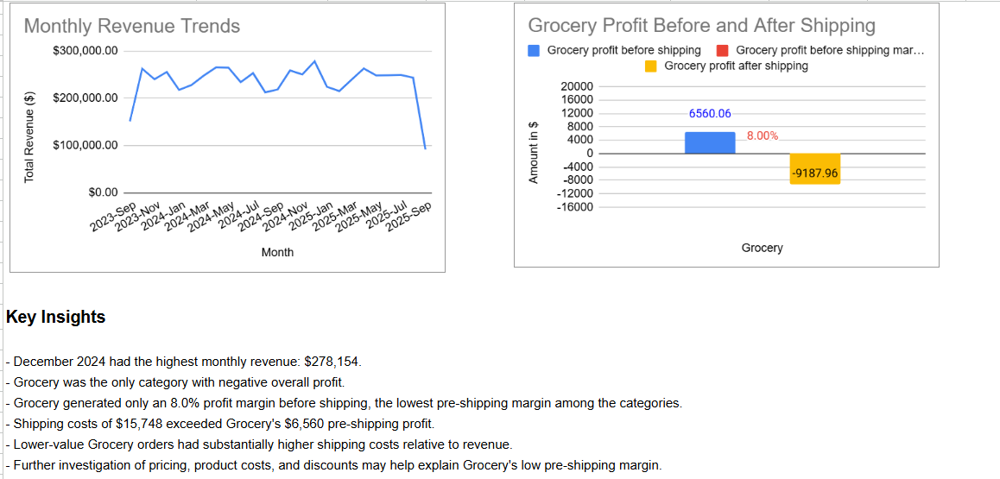
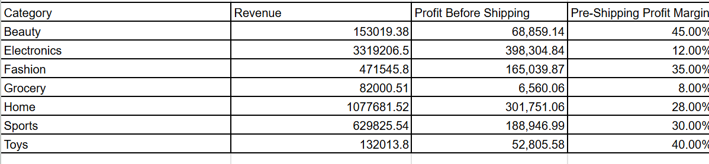
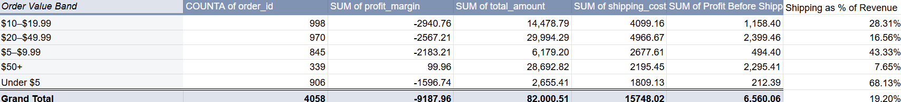

# E-commerce Sales & Profitability Analysis

## Project Overview

This project analyzes an e-commerce sales transaction dataset using **Google Sheets** to explore sales performance, profitability, order trends, and shipping costs.

The project demonstrates an end-to-end analytical workflow:

**Data → Cleaning → Validation → Analysis → Visualization → Insights**

The final output is a dashboard supported by detailed analysis and an audit sheet used to validate the main KPIs.

**Dataset note:** The dataset is a synthetic e-commerce transaction dataset sourced from Kaggle and is used for educational and portfolio purposes.

## Project Dashboard & Analysis

The analysis was created in **Google Sheets**, including data cleaning, calculations, analysis, audit checks, pivot tables, and dashboard design.

**[View the Google Sheets Ecommerce Sales Project](https://docs.google.com/spreadsheets/d/1zWT1M9z29xKWRTzQaO49cEMsisYunom-27P1KRl14lk/edit?usp=sharing)**

The workbook contains the following sheets:

* `raw_data` — The downloaded dataset
* `data_check` — Checks for potential data anomalies
* `cleaned_data` — Cleaned dataset with additional calculated fields used for the analysis:
  * `Shipping % of Revenue` — Shipping cost as a percentage of revenue
  * `Profit Status` — Identifies transactions as profitable or loss-making
  * `Order Value Band` — Groups orders into value ranges for comparison
  * `Profit Before Shipping` — Profit after excluding shipping costs
* `analysis` — KPI calculations, category analysis, shipping analysis, and Grocery deep dive
* `dashboard` — Final KPI cards, visualizations, and key insights
* `insights` — Summary of key findings, profitability issues, potential drivers, and data limitations
* `audit` — Formula-based validation of the main KPIs

## Project Objectives

The main objectives were to understand:

* How revenue and order volume change over time
* Overall sales and profitability performance
* How profitability varies across product categories
* How shipping costs affect profitability
* Whether lower-value orders have different shipping-cost characteristics
* Whether the analysis reveals any areas that warrant further investigation

### Business Question

**How are sales, profitability, and shipping costs performing across time, product categories, and order values?**

## Dataset

The dataset used for this project is the **E-commerce Sales Transactions Dataset** from Kaggle.

The dataset is a **synthetic e-commerce transaction dataset** containing **34,500 transaction records**. It includes fields covering orders, customers, products, pricing, quantities, payment methods, dates, delivery information, regions, returns, revenue, shipping costs, and profit.

### Key fields used in the analysis

* `order_id`
* `customer_id`
* `product_id`
* `category`
* `price`
* `discount`
* `quantity`
* `payment_method`
* `order_date`
* `delivery_time_days`
* `region`
* `returned`
* `total_amount`
* `shipping_cost`
* `profit_margin`
* `customer_age`
* `customer_gender`

**Note:** The dataset's `profit_margin` field is treated in this analysis as a profit amount in currency rather than a percentage. Profit margin percentages are calculated as **profit divided by revenue**.

## Tools & Skills

### Tools

* Google Sheets
* Pivot Tables
* Google Sheets formulas
* Charts and dashboard design

### Skills demonstrated

* Data cleaning and preparation
* Data validation
* KPI calculation
* Aggregation and summarization
* Time-series analysis
* Category analysis
* Profitability analysis
* Cost analysis
* Data visualization
* Dashboard creation
* Analytical storytelling

## Key Performance Indicators

| Metric | Result |
|---|---:|
| Total Revenue | **$5,865,293.05** |
| Total Profit | **$970,019.41** |
| Total Orders | **34,500** |
| Average Order Value | **$170.01** |
| Overall Profit Margin | **16.54%** |
| Total Quantity Sold | **51,430** |
| Average Quantity per Order | **1.49** |

---

## Key Findings

### 1. Revenue varied across the period

Monthly revenue varied throughout the dataset.

**December 2024 recorded the highest monthly revenue at $278,154.**

Monthly order volume also varied across the period, providing a useful comparison between changes in revenue and changes in the number of orders.

**Important:** The dataset covers September 12, 2023 to September 11, 2025. Therefore, September 2023 and September 2025 represent partial months and should not be directly compared with full months without considering the difference in coverage.

### 2. Grocery was the only category with negative overall profit

The category analysis showed substantial differences in profitability across categories.

| Category | Revenue | Profit | Profit Margin |
|---|---:|---:|---:|
| Electronics | $3,319,206.50 | $344,371.77 | 10.38% |
| Home | $1,077,681.52 | $262,633.70 | 24.37% |
| Sports | $629,825.54 | $160,521.41 | 25.49% |
| Fashion | $471,545.80 | $128,814.65 | 27.32% |
| Beauty | $153,019.38 | $49,196.59 | 32.15% |
| Toys | $132,013.80 | $33,669.25 | 25.50% |
| Grocery | $82,000.51 | **-$9,187.96** | **-11.20%** |

Grocery was the only category with an overall negative profit in the analysis.

However, looking at profitability **before shipping costs** provides additional context:

Grocery had the **lowest pre-shipping profit margin among all categories at 8.0%**, indicating that the category was already relatively low-margin before shipping costs were applied.

### 3. Shipping costs pushed Grocery from low-margin to loss-making

A deeper analysis of Grocery showed that the category was already the lowest-margin category before shipping costs.

* **Revenue:** $82,000.51
* **Profit before shipping:** $6,560.06
* **Pre-shipping profit margin:** 8.0%
* **Shipping costs:** $15,748.02
* **Profit after shipping:** -$9,187.96
* **Grocery orders:** 4,058

Shipping costs exceeded Grocery's pre-shipping profit, turning a positive pre-shipping result into an overall loss.

The analysis therefore suggests that Grocery's profitability issue involves both a **relatively low pre-shipping margin and substantial shipping costs**. Further analysis of **selling prices, product costs, and discount levels**, alongside shipping and order value, could help explain the underlying drivers.

### 4. Lower-value Grocery orders had higher shipping costs relative to revenue

The Grocery order-value analysis showed a clear relationship between order value and shipping costs as a percentage of revenue.

Lower-value Grocery orders had substantially higher shipping costs relative to their revenue. For orders under $5, shipping represented **68.13% of revenue**, compared with **7.65% for orders of $50 or more**.

This pattern helps explain why shipping has such a significant effect on Grocery profitability. However, the analysis shows an **observed relationship rather than proof of causation**. The relatively low pre-shipping margin also suggests that factors such as pricing, product costs, and discounts should be investigated alongside shipping costs.

## Dashboard

The final Google Sheets dashboard contains:

### KPI Summary

* Revenue
* Profit
* Orders
* Average Order Value
* Profit Margin

### Visualizations

* **Monthly Revenue Trend**
* **Monthly Order Volume**
* **Grocery Profitability: Impact of Shipping**

The dashboard was designed to provide a quick overview of overall performance while highlighting the Grocery profitability issue identified during the analysis.

## Data Validation & Audit

An Audit sheet was created to validate the main dashboard KPIs against calculations made directly from the cleaned dataset.

| Check | Result | Status |
|---|---:|:---:|
| Total Revenue | $5,865,293.05 | PASS |
| Total Profit | $970,019.41 | PASS |
| Total Orders | 34,500 | PASS |
| Average Order Value | $170.01 | PASS |
| Overall Profit Margin | 16.54% | PASS |

This was included to make sure the figures presented in the dashboard were consistent with the underlying cleaned data.

## Project Takeaways

This project demonstrates an end-to-end approach to analyzing transactional data, from data preparation and validation through to analysis, visualization, and business insight.

Key areas demonstrated include:

* Data cleaning and preparation
* KPI calculation and validation
* Pivot-table based analysis
* Time-series and category analysis
* Profitability and cost analysis
* Investigating potential drivers behind an unexpected business result
* Dashboard design and data visualization
* Communicating findings and limitations clearly

A key takeaway from the analysis is that **revenue alone does not provide a complete view of business performance**. Examining profit and costs revealed that Grocery was the only loss-making category. The category also had the **lowest pre-shipping profit margin at 8.0%**, while shipping costs exceeded its pre-shipping profit and resulted in an overall loss. These findings highlight shipping costs, order value, and the category's underlying margin as areas warranting further investigation.

## Limitations

There are several limitations to this analysis:

* The dataset is limited to the variables provided in the source data.
* September 2023 and September 2025 are partial months and should therefore be interpreted with caution when comparing monthly trends.
* The analysis describes patterns within the dataset and does not establish causal relationships.
* The Grocery analysis identifies both a low pre-shipping profit margin and shipping costs as contributors to the category's negative profitability. Other factors, such as product costs, pricing, or discounts, may also contribute to the result. These factors were not investigated at a detailed product level in this project.
* Shipping costs are analyzed at the transaction/category level and may not represent the full operational cost structure of a real e-commerce business.
* The analysis does not include additional business context such as supplier costs, marketing spend, employee costs, warehouse costs, or customer acquisition costs.

These limitations should be considered when interpreting the findings.

## Future Improvements

If expanding this project further, possible next steps could include:

* Investigating Grocery at the product level to identify whether pricing, product costs, or discount levels contribute to the low pre-shipping profit margin
* Customer segmentation and repeat-customer analysis
* Return-rate analysis by category and region
* Regional performance analysis
* Payment-method analysis
* Product-level profitability analysis
* More detailed shipping-cost analysis by order value and category
* Adding interactive dashboard filters for category, region, and time period
* Expanding the audit checks to validate additional calculated metrics
* Adding further visualizations to explore relationships between order value, shipping costs, and profitability

## Conclusion

This project demonstrates an end-to-end data analysis workflow using Google Sheets, covering data preparation, validation, analysis, visualization, and business insight.

The analysis moved from overall sales performance into category-level profitability and then into a more detailed investigation of Grocery. The calculated analytical fields, including `Profit Before Shipping`, `Shipping % of Revenue`, `Profit Status`, and `Order Value Band`, helped identify and investigate the factors contributing to the category's negative profitability.

The analysis found that **Grocery had the lowest pre-shipping profit margin among the categories analyzed, at 8.0%**. Shipping costs of $15,748.02 then exceeded the category's $6,560.06 pre-shipping profit, resulting in an overall category loss of approximately **$9.2K**.

The lower-value Grocery order analysis also showed that shipping represented a substantially larger share of revenue for smaller orders, reaching **68.13% for orders under $5** compared with **7.65% for orders of $50 or more**.

Overall, the findings suggest that Grocery's profitability issue involves both its relatively low underlying margin and shipping costs. Further investigation into **product costs, pricing, discount levels, and order-level shipping economics** would be required to understand the underlying drivers more fully.

The project also demonstrates the importance of **validating calculated metrics before presenting them through a dashboard**, helping ensure that the reported KPIs and findings are consistent with the underlying data.

---

## Dataset Source

**Kaggle:** [E-commerce Sales Transactions Dataset](https://www.kaggle.com/datasets/miadul/e-commerce-sales-transactions-dataset)

Created as a personal data analytics portfolio project.

